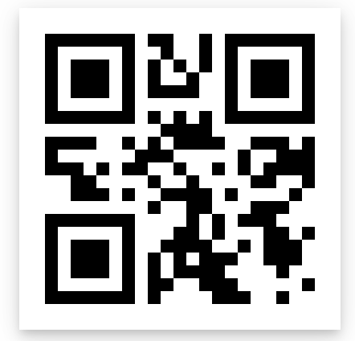

# NutriQR

## Main Idea

As a part of an ASU business class, my group and I were tasked with coming up with a business idea and creating a pitch for it.

Our idea was NutriQR, an iOS app that provides point-and-scan access to chef-verified nutritional information for menu items
at restaurants. The idea would require restaurants to add QR codes to their menus, and customers could scan these codes to receive more information about the specific food item.

## Screenshots
I used several food items from Outback Steakhouse to serve as sample food items. Below are the QR codes that represent each food item, along with a screenshot of the app after the QR code has been scanned.

### 8 oz. Grilled Chicken
 
